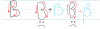
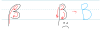
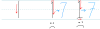

# Penmanship for physicists

[TOC]

Why teach penmanship to physicists? One reason is that physics causes us to use writing in a way that differs greatly from the circumstances in which we all learned to write.  The written English language (and other languages) has a vast amount of redundancy, which allows us to accurately read even very poor writing.  When working on physics, this redundancy largely doesn't exist, so a single poorly written letter can completely derail a calculation.  On top of this, we use a huge number of *different* letters (including Greek letters) in combination, which increases the possibility of confusion.

Sadly, physicists are traditionally not taught penmanship, with the result that *I* have not been taught either.  This page is thus the result of my experience both with confusions introduced in my own writing, and also with confusion I have seen in student writing.  There is not a single *correct* way to write a given letter, but there are certainly ways to write letters that will result in confusion when anyone else tries to read (and grade!) your work. 

## $a$

The letter 'a' is actually pretty hard to get wrong.  About the only thing I've encountered (and pretty rarely) is a "fancy" a.  Just don't do anything fancy, and you won't risk your 'a' being misunderstood.  Note that there *is* a possibility of confusion with 'd' if you are sloppy, but a little care can avoid that problem.

## $b$

The letter $b$ is pretty standard also.  The only mistake I'm aware of is shown on the right.  If you draw the "circle" portion of the $b$ in a counter-clockwise way, your $b$ could turn into a $6$.

## $B$

The main wrong way to write the letter $B$ can be mistaken as the number $13$.

## $\beta$

The greek letter $\beta$ can be a little tricky if you aren't used to it.  It looks a lot like a $B$.  The key is that you start at the bottom and draw it with one stroke.  Ideally you also want to start low down, but often that is not distinguishable when writing math.

## $c$

The letter $c$ another easy one.  I don't know that I've ever seen it mistaken.

## $d$

The letter $d$ a common source of trouble.  The most common error I've seen is shown above.  If you draw your $d$ starting at the top like this (and in one stroke), it's almost impossible to distinguish between $d$ and a partial derivative symbol $\partial$.  Thus it becomes *essential* to learn to draw your $d$ correctly, since there are times where the distinction between these two symbols is essential.

## $\delta$

The greek letter $\delta$ can also be tricky.  It looks a lot like a $\partial$, but has a little flag on the top (or a curve to the right).

## $\partial$

The partial derivative $\partial$ is pretty new to many students, and not covered in elementary school.  It's not hard to draw, so long as your $d$ is not drawn in the way I warn about above.

## $1$

The number $1$ is pretty simple, but still manages to have a few common ways to do it wrong.  Most essentially, it can be tempting to put a little angle on the top of your ones.  I expect this comes from a misguided effort to distinguish $1$ from $\ell$.  Unfortunately, this results in a digit that can easily turn into a seven when written sloppily.

